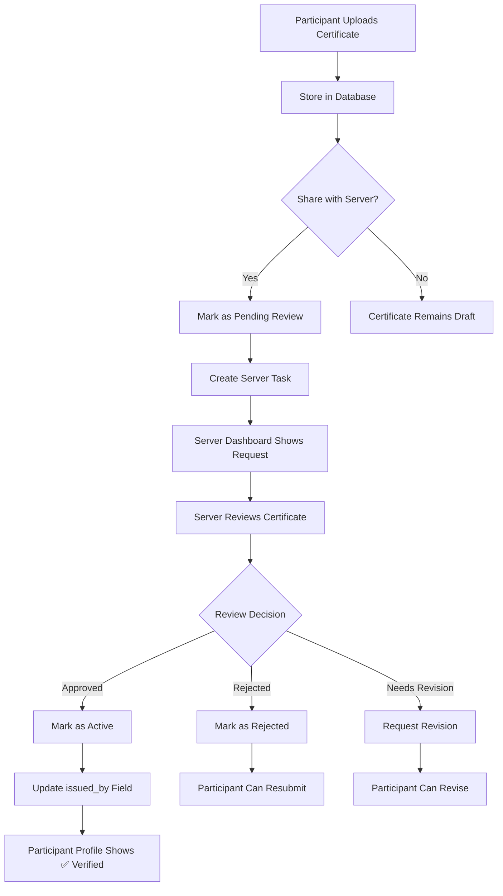

# 🏗️ EcoVolunteer PRO - Architecture Documentation

## 🔄 Certificate Roll Process Architecture

### 📋 Process Flow Overview



## 🗄️ Database Architecture

### Core Tables Flow

```sql
-- 1. Certificate Upload
participant_certifications (INSERT)
├── id UUID PRIMARY KEY
├── participant_id UUID (FK)
├── certification_name TEXT
├── certification_type TEXT
├── issued_date TIMESTAMP
├── expiry_date TIMESTAMP
├── achievement_criteria TEXT
├── certificate_url TEXT
├── is_active BOOLEAN DEFAULT FALSE
├── shared_with_server UUID (FK to server_profiles)
├── sharing_status TEXT DEFAULT 'not_shared'
├── sharing_request_date TIMESTAMP
├── sharing_review_date TIMESTAMP
├── sharing_reviewed_by UUID (FK to profiles)
└── created_at TIMESTAMP

-- 2. Server Task Creation
server_tasks (INSERT via RPC)
├── id UUID PRIMARY KEY
├── server_id UUID (FK)
├── task_name TEXT
├── task_description TEXT
├── task_type TEXT
├── priority TEXT
├── due_date TIMESTAMP
├── status TEXT
└── created_at TIMESTAMP

-- 3. Review Process
server_review_dashboard (VIEW)
├── Joins participant_certifications + profiles + server_profiles
├── Filters by server_id
├── Shows pending/under_review certificates
└── Ordered by request_date
```

## 🌐 Frontend Architecture

### Client-Side Flow

```typescript
// 1. Upload Process
const handleUpload = async () => {
  // Upload file to Supabase Storage
  const { data: uploadData } = await supabase.storage
    .from('certificates')
    .upload(fileName, file);
  
  // Create certificate record
  const { data: certData } = await supabase
    .from('participant_certifications')
    .insert({
      participant_id: user.id,
      certification_name: data.name,
      certificate_url: publicUrl,
      is_active: false // Initially inactive
    });
  
  // Share with server if selected
  if (shareWithServer) {
    await supabase.rpc('share_certificate_for_review', {
      participant_uuid: user.id,
      server_uuid: selectedServer,
      certification_uuid: certData.id
    });
    // Status changes to: 'pending'
  }
};

// 2. Status Display
const getStatusBadge = (cert) => {
  if (cert.is_active && cert.issued_by) {
    return <Badge className="bg-green-100">✅ Verified</Badge>;
  }
  return <Badge className="bg-yellow-100">⏳ Pending</Badge>;
};
```

### Server-Side Flow

```typescript
// 1. Certificate Review Dashboard
const fetchCertificates = async () => {
  const { data } = await supabase
    .from('server_review_dashboard')
    .select('*')
    .eq('server_id', serverData.id);
  
  setCertificates(data);
};

// 2. Review Process
const handleReview = async (certId, status) => {
  await supabase.rpc('review_shared_certificate', {
    certification_uuid: certId,
    reviewer_uuid: serverUser.id,
    review_status: status
  });
  
  // Updates multiple fields:
  // - sharing_status
  // - sharing_review_date  
  // - sharing_reviewed_by
  // - issued_by (if approved)
  // - is_active (if approved)
};
```

## 🔧 Backend Functions

### RPC Functions

```sql
-- 1. Share Certificate for Review
CREATE OR REPLACE FUNCTION share_certificate_for_review(
  participant_uuid UUID,
  server_uuid UUID, 
  certification_uuid UUID
) RETURNS BOOLEAN AS $$
BEGIN
  -- Update certificate with sharing details
  UPDATE participant_certifications
  SET 
    shared_with_server = server_uuid,
    sharing_status = 'pending',
    sharing_request_date = NOW()
  WHERE id = certification_uuid;
  
  -- Create server task
  INSERT INTO server_tasks (
    server_id, task_name, task_type, status
  ) VALUES (
    server_uuid, 
    'Review Certificate: ' || cert_name,
    'certification',
    'pending'
  );
  
  RETURN TRUE;
END;
$$ LANGUAGE plpgsql;

-- 2. Review Certificate
CREATE OR REPLACE FUNCTION review_shared_certificate(
  certification_uuid UUID,
  reviewer_uuid UUID,
  review_status TEXT
) RETURNS BOOLEAN AS $$
BEGIN
  -- Update certificate based on review
  UPDATE participant_certifications
  SET 
    sharing_status = review_status,
    sharing_review_date = NOW(),
    sharing_reviewed_by = reviewer_uuid,
    issued_by = CASE WHEN review_status = 'approved' THEN reviewer_uuid ELSE issued_by END,
    is_active = CASE WHEN review_status = 'approved' THEN TRUE ELSE is_active END
  WHERE id = certification_uuid;
  
  -- Update server task
  UPDATE server_tasks
  SET status = CASE 
    WHEN review_status = 'approved' THEN 'completed'
    WHEN review_status = 'rejected' THEN 'completed'
    ELSE 'pending'
  END
  WHERE server_id = (SELECT shared_with_server FROM participant_certifications WHERE id = certification_uuid);
  
  RETURN TRUE;
END;
$$ LANGUAGE plpgsql;
```

## 🔄 State Management Flow

### Certificate Status Transitions

```
not_shared → pending → under_review → approved → active
     ↓              ↓              ↓
   (optional)    (server action) (server action)
     ↓              ↓              ↓
   rejected ←───────┘
     ↓
   needs_revision ←────────┘
```

### Data Flow

1. **Upload Phase:**
   - File → Supabase Storage
   - Metadata → participant_certifications table
   - Status: `is_active: false`

2. **Sharing Phase:**
   - Trigger: `share_certificate_for_review()` RPC
   - Updates: `sharing_status = 'pending'`
   - Creates: Server task in `server_tasks`

3. **Review Phase:**
   - Server views: `server_review_dashboard` view
   - Actions: `review_shared_certificate()` RPC
   - Updates: Multiple fields based on decision

4. **Verification Phase:**
   - Approved: `issued_by = server_id`, `is_active = true`
   - Display: ✅ Green tick in participant profile
   - Rejected: `sharing_status = 'rejected'`, can resubmit

## 🎯 Key Components

### Frontend Components

| Component | Location | Purpose |
|-----------|----------|---------|
| `UploadCertificatePage` | `/(client)/certifications/upload/page.tsx` | File upload & metadata |
| `CertificationsPage` | `/(client)/certifications/page.tsx` | Status display with verification |
| `ShareCertificatePage` | `/(client)/certifications/share/page.tsx` | Share for review |
| `ServerCertificationsPage` | `/server/dashboard/certifications/page.tsx` | Review interface |

### Backend Views

| View | Purpose | Tables |
|-------|---------|----------|
| `server_review_dashboard` | Certificate review interface | participant_certifications + profiles + server_profiles |
| `participant_certificate_sharing` | Sharing analytics | participant_certifications + server_profiles |
| `certificate_sharing_analytics` | Server performance | server_profiles + participant_certifications |

## 🔒 Security Model

### Row Level Security (RLS)

```sql
-- Participant can only view/update their own certificates
CREATE POLICY "Participants can view their own certifications"
  ON participant_certifications FOR SELECT
  USING (auth.uid() = participant_id);

-- Server can only view certificates shared with them
CREATE POLICY "Servers can view shared certifications"
  ON participant_certifications FOR SELECT
  USING (auth.uid() IN (SELECT user_id FROM server_profiles WHERE id = shared_with_server));
```

## 📊 Performance Considerations

### Database Optimization
- **Indexes** on sharing_status, shared_with_server, request_date
- **Views** for complex joins (server_review_dashboard)
- **RPC Functions** for multi-table operations
- **Storage Bucket** with file size limits (5MB)

### Frontend Optimization
- **Lazy loading** for certificate lists
- **Optimistic updates** for status changes
- **Error boundaries** for upload failures
- **Progressive loading** for large certificate lists

## 🚀 Deployment Architecture

### Environment Variables
```env
NEXT_PUBLIC_SUPABASE_URL=your-project.supabase.co
NEXT_PUBLIC_SUPABASE_ANON_KEY=your-anon-key
```

### File Structure
```
/
├── app/
│   ├── (client)/certifications/     # Participant-facing
│   └── server/dashboard/             # Server-facing
├── lib/supabase/                    # Database clients
├── scripts/                          # Database migrations
└── components/ui/                     # Reusable components
```

This architecture ensures a complete, secure, and scalable certificate verification system with proper separation of concerns between participant and server roles.
